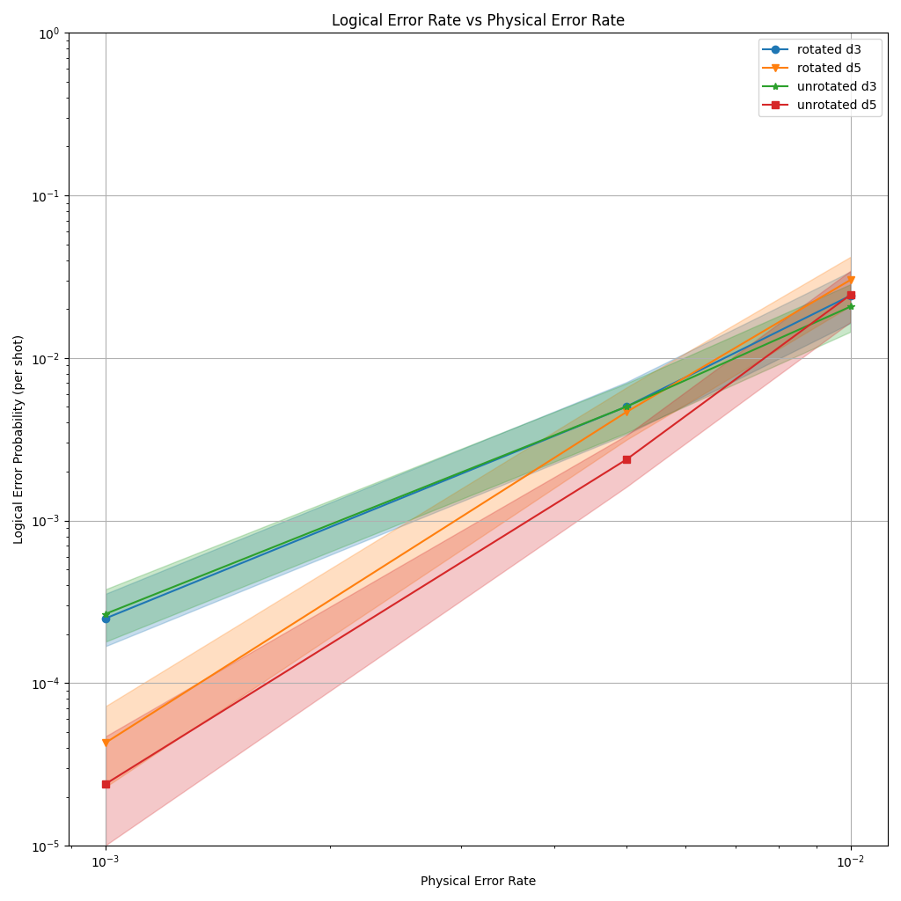

# sinter: fast QEC sampling

> **sinter is still in development. Its API and output formats are not stable.** 

Sinter is a software tool/library for doing fast monte carlo sampling of
quantum error correction circuits.

- [How it works](#how_it_works)
- [How to install](#how_to_install)
- [How to use: Python API](#how_to_use_python)
- [How to use: Linux Command Line](#how_to_use_linux)
- [The csv format for sample statistics](#csv_format)

<a name="how_to_works"></a>
# How it works

> **sinter is still in development. Its API and output formats are not stable.** 

Sinter takes Stim circuits annotated with noise, detectors, and logical
observables.
It uses stim to sample the circuits and pymatching to predict whether the
logical observables were flipped or not, given the detector data.
It records how often this succeeds, and how often it fails (the error rate).

Sinter uses python multiprocessing to do parallel sampling across multiple CPU
cores, dynamically decides which circuits need more samples based on parameters
specified by the user (such as a target number of errors), saves the results to
as simple CSV format, and has some basic  plotting functionality for viewing the
results.

Sinter doesn't support cloud compute, but it does scale extremely well within
a single machine.
I've tested it on 2 core machines and 96 core machines, and it consistently gets
good resource utilization (>95%).

<a name="how_to_install"></a>
# How to install

**sinter is still in development. Its API and output formats are not stable.** 

Sinter is available as a pypi package. It can be installed using pip:

```
pip install sinter
```

When you are in a python virtual environment with sinter installed, you have
access to a command line command `sinter` which can be used to perform tasks
from the command line. You can also `import sinter` in a python program in order
to use sinter's python API.

<a name="how_to_use_python"></a>
# How to use: Python API

> **sinter is still in development. Its API and output formats are not stable.** 

This example assumes you are in a python environment with stim and sinter
installed.

```bash
import stim
import sinter
import matplotlib.pyplot as plt


# Generates surface code circuit tasks using Stim's circuit generation.
def generate_example_tasks():
    for p in [0.001, 0.005, 0.01]:
        for d in [3, 5]:
            yield sinter.Task(
                circuit=stim.Circuit.generated(
                    rounds=d,
                    distance=d,
                    after_clifford_depolarization=p,
                    code_task=f'surface_code:rotated_memory_x',
                ),
                json_metadata={
                    'p': p,
                    'd': d,
                },
            )


def main():
    # Collect the samples (takes a few minutes).
    samples = sinter.collect(
        num_workers=4,
        max_shots=1_000_000,
        max_errors=1000,
        tasks=generate_example_tasks(),
        decoders=['pymatching'],
    )

    # Print samples as CSV data.
    print(sinter.CSV_HEADER)
    for sample in samples:
        print(sample.to_csv_line())

    # Render a matplotlib plot of the data.
    fig, ax = plt.subplots(1, 1)
    sinter.plot_error_rate(
        ax=ax,
        stats=samples,
        curve_func=lambda stat: f"Rotated Surface Code d={stat.json_metadata['d']}",
        x_func=lambda stat: stat.json_metadata['p'],
    )
    ax.loglog()
    ax.set_ylim(1e-5, 1)
    ax.grid()
    ax.set_title('Logical Error Rate vs Physical Error Rate')
    ax.set_ylabel('Logical Error Probability (per shot)')
    ax.set_xlabel('Physical Error Rate')
    ax.legend()

    # Save to file and also open in a window.
    fig.savefig('plot.png')
    plt.show()


# NOTE: This is actually necessary! If the code inside 'main()' was at the
# module level, the multiprocessing children spawned by sinter.collect would
# also attempt to run that code.
if __name__ == '__main__':
    main()
```

Example output to stdout:

```
     shots,    errors,  discards, seconds,decoder,strong_id,json_metadata
   1000000,       837,         0,    36.6,pymatching,9f7e20c54fec45b6aef7491b774dd5c0a3b9a005aa82faf5b9c051d6e40d60a9,"{""d"":3,""p"":0.001}"
     53498,      1099,         0,    6.52,pymatching,3f40432443a99b933fb548b831fb54e7e245d9d73a35c03ea5a2fb2ce270f8c8,"{""d"":3,""p"":0.005}"
     16269,      1023,         0,    3.23,pymatching,17b2e0c99560d20307204494ac50e31b33e50721b4ebae99d9e3577ae7248874,"{""d"":3,""p"":0.01}"
   1000000,       151,         0,    77.3,pymatching,e179a18739201250371ffaae0197d8fa19d26b58dfc2942f9f1c85568645387a,"{""d"":5,""p"":0.001}"
     11363,      1068,         0,    12.5,pymatching,a4dec28934a033215ff1389651a26114ecc22016a6e122008830cf7dd04ba5ad,"{""d"":5,""p"":0.01}"
     61569,      1001,         0,    24.5,pymatching,2fefcc356752482fb4c6d912c228f6d18762f5752796c668b6abeb7775f5de92,"{""d"":5,""p"":0.005}"
```

and the corresponding image saved to `plot.png`:



<a name="how_to_use_linux"></a>
# How to use: Linux Command Line

> **sinter is still in development. Its API and output formats are not stable.** 

This example assumes you are using a linux command line in a python virtualenv with `sinter` installed.

## pick circuits

For this example, we will use Stim's circuit generation functionality to produce
circuits to benchmark.
We will make rotated surface code circuits with various physical error rates,
with filenames like `rotated_d5_p0.001_surface_code.stim`.

```bash
mkdir -p circuits
python -c "

import stim

for p in [0.001, 0.005, 0.01]:
    for d in [3, 5]:
        with open(f'circuits/rotated_d{d}_p{p}_surface_code.stim', 'w') as f:
            c = stim.Circuit.generated(
                rounds=d,
                distance=d,
                after_clifford_depolarization=p,
                after_reset_flip_probability=p,
                before_measure_flip_probability=p,
                before_round_data_depolarization=p,
                code_task=f'surface_code:rotated_memory_x')
            print(c, file=f)

"
```

Normally, making the circuit files is the hardest step, because they are what
specifies the problem you are sampling from.
Almost all of the work you do will generally involve creating the exact perfect
circuit file for your needs.
But this is just an example, so we'll use normal surface code circuits.

# collect

You can use sinter to collect statistics on each circuit by using the `sinter collect` command.
This command takes options specifying how much data to collect, how to do decoding, etc.

By default, sinter writes the collected statistics to stdout as CSV data.
One particularly important option that changes this behavior is `-save_resume_filepath`,
which allows the command to be interrupted and restarted without losing data.
Any data already at the file specified by `-save_resume_filepath` will count towards the
amount of statistics asked to be collected, and sinter will append new statistics to this file
instead of overwriting it.

```bash
sinter collect \
    -processes 4 \
    -circuits circuits/*.stim \
    -metadata_func "(v := path.split('/')[-1].split('_')) and {
        'd': int(v[1][1:]),
        'p': float(v[2][1:])
    }" \
    -decoders pymatching \
    -max_shots 1_000_000 \
    -max_errors 1000 \
    -save_resume_filepath stats.csv
```

Beware that if you SIGKILL or SIGTEM sinter, instead of just using SIGINT, it's possible
(though unlikely) that you are killing it just as it writes a row of CSV data. This truncates
the data, which requires manual intervention on your part to fix (e.g. by deleting the partial row
using a text editor).

# combine

Note that the CSV data written by sinter will contain multiple rows for each case, because
sinter starts by running small batches to see roughly what the error rate is before moving
to larger batch sizes. 

You can get a single-row-per-case CSV file by using `sinter combine`:

```bash
sinter combine stats.csv
```

```
     shots,    errors,  discards, seconds,decoder,strong_id,json_metadata
   1000000,       837,         0,    36.6,pymatching,9f7e20c54fec45b6aef7491b774dd5c0a3b9a005aa82faf5b9c051d6e40d60a9,"{""d"":3,""p"":0.001}"
     53498,      1099,         0,    6.52,pymatching,3f40432443a99b933fb548b831fb54e7e245d9d73a35c03ea5a2fb2ce270f8c8,"{""d"":3,""p"":0.005}"
     16269,      1023,         0,    3.23,pymatching,17b2e0c99560d20307204494ac50e31b33e50721b4ebae99d9e3577ae7248874,"{""d"":3,""p"":0.01}"
   1000000,       151,         0,    77.3,pymatching,e179a18739201250371ffaae0197d8fa19d26b58dfc2942f9f1c85568645387a,"{""d"":5,""p"":0.001}"
     11363,      1068,         0,    12.5,pymatching,a4dec28934a033215ff1389651a26114ecc22016a6e122008830cf7dd04ba5ad,"{""d"":5,""p"":0.01}"
     61569,      1001,         0,    24.5,pymatching,2fefcc356752482fb4c6d912c228f6d18762f5752796c668b6abeb7775f5de92,"{""d"":5,""p"":0.005}"
```

# plot

You can use `sinter plot` to view the results you've collected.
This command takes a CSV file, and also some command indicating how to group each case
into single curves and also what the desired X coordinate of a case is.
This is done in a flexible but very hacky way, by specifying a python expression using the case's filename: 

```bash
sinter plot \
    -in stats.csv \
    -group_func "'Rotated Surface Code d=' + str(metadata['d'])" \
    -x_func "metadata['p']" \
    -fig_size 1024 1024 \
    -xaxis "[log]Physical Error Rate" \
    -out surface_code_figure.png \
    -show
```

Which will save a png image of, and also open a window showing, a plot like this one:


<a name="csv_format"></a>
# The csv format for sample statistics

> **sinter is still in development. Its API and output formats are not stable.** 

Sinter saves samples as a table using a Comma Separated Value format.
For example:

```
  shots,errors,discards,seconds,decoder,strong_id,json_metadata
1000000,   837,       0,   36.6,pymatching,9f7e20c54fec45b6aef7491b774dd5c0a3b9a005aa82faf5b9c051d6e40d60a9,"{""d"":3,""p"":0.001}"
  53498,  1099,       0,   6.52,pymatching,3f40432443a99b933fb548b831fb54e7e245d9d73a35c03ea5a2fb2ce270f8c8,"{""d"":3,""p"":0.005}"
  16269,  1023,       0,   3.23,pymatching,17b2e0c99560d20307204494ac50e31b33e50721b4ebae99d9e3577ae7248874,"{""d"":3,""p"":0.01}"
1000000,   151,       0,   77.3,pymatching,e179a18739201250371ffaae0197d8fa19d26b58dfc2942f9f1c85568645387a,"{""d"":5,""p"":0.001}"
  11363,  1068,       0,   12.5,pymatching,a4dec28934a033215ff1389651a26114ecc22016a6e122008830cf7dd04ba5ad,"{""d"":5,""p"":0.01}"
  61569,  1001,       0,   24.5,pymatching,2fefcc356752482fb4c6d912c228f6d18762f5752796c668b6abeb7775f5de92,"{""d"":5,""p"":0.005}"
```

The columns are:

- `shots` (unsigned int): How many times the circuit was sampled.
- `errors` (unsigned int): How many times the decoder failed to predict the logical observable.
- `discards` (unsigned int): How many times decoding was skipped because a postselected detector fired.
- `seconds` (non-negative float): How many CPU core seconds it took to simulate and decode these shots.
- `decoder` (str): Which decoder was used.
- `strong_id` (str):
Hex representation of a cryptographic hash of the problem
being sampled from.
The hashed data includes the exact circuit that was simulated,
the decoder that was used,
the exact detector error model that was given to the decoder,
the postselection rules that were applied,
and the metadata associated with the circuit.
The purpose of the strong id is to make it impossible to accidentally combine
shots that were from separate circuits or separate versions of a circuit.
- `json_metadata` (json): A free form field that can store any value representable in
[Java Script Object Notation](https://json.org). For example, this could be a
dictionary with helpful keys like "noise_level" or "circuit_name". The json
value is serialized into JSON and then escaped so that it can be put into the
CSV data (e.g. quotes get doubled up).

Note shots may be spread across multiple rows.
For example, this data:

```
  shots,errors,discards,seconds,decoder,strong_id,json_metadata
 500000,   437,       0,   20.5,pymatching,9f7e20c54fec45b6aef7491b774dd5c0a3b9a005aa82faf5b9c051d6e40d60a9,"{""d"":3,""p"":0.001}"
 500000,   400,       0,   16.1,pymatching,9f7e20c54fec45b6aef7491b774dd5c0a3b9a005aa82faf5b9c051d6e40d60a9,"{""d"":3,""p"":0.001}"
```

has the same total statistics as this data:

```
  shots,errors,discards,seconds,decoder,strong_id,json_metadata
1000000,   837,       0,   36.6,pymatching,9f7e20c54fec45b6aef7491b774dd5c0a3b9a005aa82faf5b9c051d6e40d60a9,"{""d"":3,""p"":0.001}"
```

just split over two rows instead of combined into one.
